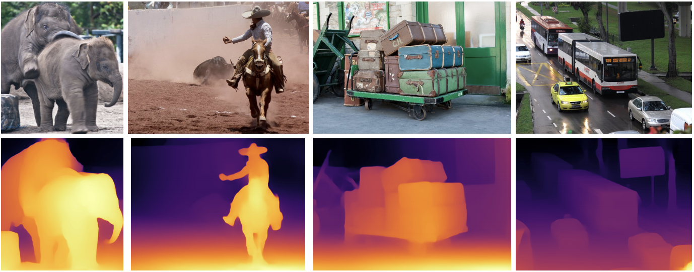

# Monodepth Demo




Monocular Depth Estimation is the task of estimating scene depth using a single image. It has many potential applications in robotics, 3D reconstruction, medical imaging and autonomous systems. For this demo, we use a neural network model called MiDaS which was developed by the Intelligent Systems Lab at Intel. Check out their research paper to learn more.

R. Ranftl, K. Lasinger, D. Hafner, K. Schindler and V. Koltun, "Towards
Robust Monocular Depth Estimation: Mixing Datasets for Zero-shot
Cross-dataset Transfer," in IEEE Transactions on Pattern Analysis and Machine
Intelligence, doi: 10.1109/TPAMI.2020.3019967.


This notebook demonstrates Monocular Depth Estimation with the MidasNet model
in OpenVINO.
https://github.com/openvinotoolkit/open_model_zoo/blob/master/models/public/midasnet/midasnet.md

# Installation Instructions

_This notebook is a work in progress demo! It has been tested on Windows, macOS and Linux with Python 3.6 and 3.7._

## 1. Clone the repository, go to the directory, and checkout the develop branch

```
git clone https://github.com/helena-intel/openvino-notebooks.git
cd openvino-notebooks
git checkout develop
cd 201-vision-monocular-depth-estimation
```

## 2. Create a Virtual Environment.

**NOTE:**

- On Windows, if you installed multiple Python versions, you can use `py -3.7` instead of `python` to specify a version
- On Linux or macOS you may need to type `python3` instead of `python` and you may need to install pip: https://pip.pypa.io/en/stable/installing/

```
python -m pip install --user virtualenv
python -m venv openvino_env
```

## 3. Activate the Virtual Environment

On Linux:

```
source openvino_env/bin/activate
```

On Windows:

```
openvino_env\Scripts\activate
```

## 4. Install the required Python packages

Upgrade pip to ensure compatibility with newest OpenVINO version and install the requirements for the notebook

```
python -m pip install --upgrade pip==20.1.1
pip install -r requirements.txt
```

## 5. Install the virtualenv kernel in Jupyter

```
python -m ipykernel install --user --name openvino_env
```

## 6. Start the demo!

```
jupyter notebook 201-vision-monocular-depth-estimation.ipynb
```

or

```
jupyter lab
```

If you use Jupyter Lab, select the notebook from the file browser on the left.

# Troubleshooting

If you get an ImportError, check that you installed the Jupyter kernel in step 5. If necessary, select the kernel for your virtual environment
in the _Kernel->Change Kernel_ menu item.

On Linux, if you get the error "libpython3.7m.so.1.0: cannot open shared object file: No such object or directory" install the required
package with `sudo apt install libpython3.7-dev`
